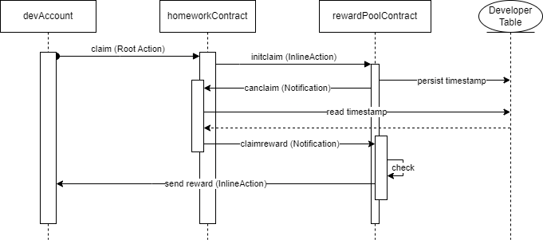

# Reward Contracts (Homework)

The following sequence diagram outlines how the homework contract is intended to interact with the reward pool contract in order to claim the XPR.

Note: This is a designed example and its purpose is to understand and apply the 4 core concepts:
- Root Actions
- Inline Actions
- Notifications
- Storage

## Sequence Diagram
